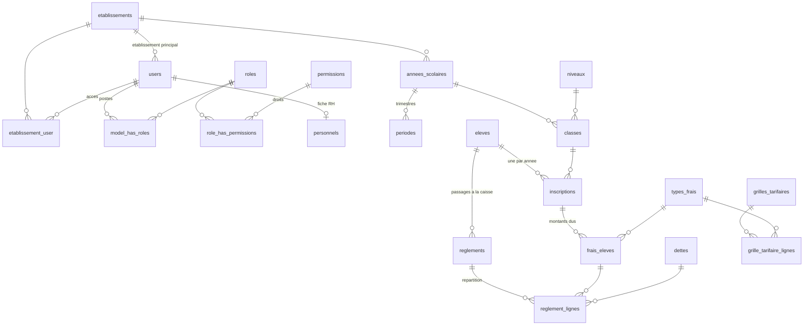

# Base de données — Monde Éducatif V2

Rôle de chaque table, liaisons entre tables, et correspondance avec la V1.

- **Moteur** : MySQL, base `monde_edu_v2` (voir `.env`).
- **Source de vérité** : les migrations dans `database/migrations/`. En cas de doute, ce sont elles qui font foi : ce document doit être mis à jour quand elles changent.

---

## Principes généraux

1. **Une seule base pour tous les établissements.** La V1 avait une base par école. En V2, les tables métier portent une colonne `etablissement_id` (ou y sont rattachées via une table parente). Les modèles qui utilisent le trait `BelongsToEtablissement` sont filtrés automatiquement sur l'établissement de la requête (en-tête `X-Etablissement-Id`).
2. **Les niveaux sont communs à tous les établissements** (table `niveaux`, sans `etablissement_id`).
3. **Montants recopiés dans l'inscription (comme en V1).** À l'inscription, les montants dus sont copiés depuis la grille tarifaire vers l'inscription. Au paiement, on ne relit donc jamais la grille : le dû, le réduit et le payé se lisent directement sur `inscriptions` et `frais_eleves`, et ils sont recalculés automatiquement à chaque règlement ou réduction.
4. **Suppression en cascade** (`cascadeOnDelete`) : supprimer une ligne parente supprime ses lignes filles. **Mise à NULL** (`nullOnDelete`) : le lien est simplement vidé (ex. l'utilisateur qui a saisi une ligne a été supprimé).

---

## Schéma des liaisons principales

---

## 1. Établissements, comptes et droits

| Table | Rôle | Liaisons | Équivalent V1 |
|---|---|---|---|
| `etablissements` | Une ligne par école : identité (code, nom, sigle, ville…), statut d'abonnement, paramètres en JSON (`parametres`) : `effectif_max_classe` (limite générale d'élèves par classe) et `statut_visible_classe` (`classe_attribuee`, `premier_paiement` par défaut, `solde` : quand un élève apparaît dans la liste de sa classe, V1 `inscr_termine`), `rapports_masques` (rapports retirés du menu Rapports), `rapports_textes` (textes des rapports officiels de rentrée, de période et annuels, par année), `rapports_personnalises` (modèles de rapports paramétrables : colonnes, regroupement, filtres), `entete_ministere`, `entete_direction`, `entete_adresse`, `entete_telephone` (en-tête gauche des documents PDF ; adresse et téléphone vides = ceux de l'établissement). SMS : `sms_actif`, `sms_expediteur` (11 caractères max), `sms_credit` (SMS restants) — V1 `is_used_sms`, `sms_sender`, `number_sms`. | `cree_par_id` → `users` | `etablissement`, `info_etablissement` (base `bd_primaire`) |
| `users` | Comptes de connexion (e-mail + mot de passe), identité, statut actif/inactif. | `etablissement_id` → `etablissements` (établissement **principal**) | `administration` (partie connexion) |
| `etablissement_user` | **À quels établissements** un utilisateur a accès (liste « Établissement » de la modale d'espace de travail). `is_defaut` = établissement proposé en premier. | `etablissement_id` → `etablissements`, `user_id` → `users` | — (une base par école en V1) |
| `sms_rechargements` | Achats de crédit SMS : date, nombre de SMS, montant, qui l'a enregistré (droit réservé `sms.recharger`, Super admin). | `etablissement_id`, `enregistre_par_id` → `users` | `rechargement_sms` |
| `sms_messages` | Historique des SMS envoyés : numéro, message, campagne, nombre de SMS décomptés, statut (envoyé / échec). Le fournisseur (letexto / bulksmsonline) est commun à la plateforme : `config/services.php`, variables `SMS_*` du `.env`. | `etablissement_id`, `eleve_id` → `eleves`, `envoye_par_id` → `users` | `sms` (+ `parametre_global`) |
| `roles` | Les **postes** (Super admin, Fondateur, Professeur, Caissier…), **propres à chaque établissement** (colonne `etablissement_id`). Postes de départ définis dans `config/roles.php`. Colonnes ajoutées : `code` (identifiant stable des postes standard, le nom peut être renommé), `description`, `is_active` (poste désactivé = plus attribuable ni choisissable, V1 `role.is_active`), `est_sensible` (poste protégé : attribué seulement par un poste qui a le droit `utilisateurs.gerer_sensibles`, c'est-à-dire le Super admin), `lie_niveaux` (éducateur), `lie_matieres` (professeur). Modèle : `App\Models\Poste`. | `etablissement_id` → `etablissements` | `role`, `fonction` |
| `permissions` | Catalogue des **droits** possibles (`eleves.voir`, `reglements.encaisser`, `periodes.choisir`…), commun à tous les établissements. | — | `menu`, `interface` (menus codés en dur par poste) |
| `model_has_roles` | **Quel utilisateur occupe quel poste, dans quel établissement.** Un utilisateur peut avoir plusieurs postes (liste « Poste » de la modale). | `model_id` → `users`, `role_id` → `roles`, `etablissement_id` | `administration.role_code`, `role_fonction` |
| `role_has_permissions` | **Quels droits a chaque poste.** C'est la table à modifier pour paramétrer un poste (ex. autoriser le choix de la période). | `role_id` → `roles`, `permission_id` → `permissions` | — |
| `model_has_permissions` | Droits donnés **directement** à un utilisateur, en plus de ceux de ses postes. Non utilisée pour l'instant. | `model_id` → `users`, `permission_id` → `permissions` | — |
| `personnels` | Fiche RH d'un membre du personnel (diplôme, contrat, matière principale…). Un seul `personnels` par `users`. | `user_id` → `users`, `etablissement_id`, `matiere_principale_id` → `matieres` | `administration` (partie RH) |
| `educateur_niveaux` | Niveaux suivis par un éducateur **pour une année** (il inscrit et suit les élèves de ces niveaux). | `etablissement_id`, `annee_scolaire_id`, `personnel_id` → `personnels`, `niveau_id` → `niveaux` | `choix` |
| `personnel_matieres` | Matières enseignées par un professeur (plusieurs possibles). | `personnel_id` → `personnels`, `matiere_id` → `matieres` | `administration.matiere_prof` |
| `personal_access_tokens` | Jetons de connexion de l'API (Laravel Sanctum), un par session ouverte. | `tokenable_id` → `users` | — |

**Chaîne complète d'un utilisateur à ses droits** : `users` → `model_has_roles` → `roles` → `role_has_permissions` → `permissions`.
À chaque requête, l'API ne retient que les droits du **poste choisi** (en-tête `X-Poste-Id`, middleware `ResolvePoste`).

---

## 2. Organisation scolaire

| Table | Rôle | Liaisons | Équivalent V1 |
|---|---|---|---|
| `annees_scolaires` | Années scolaires d'un établissement (`2025-2026`…), avec l'année en cours (`is_active`) et les années clôturées. | `etablissement_id` | `annee` |
| `periodes` | Trimestres ou semestres d'une année (`type_decoupage`, `numero`), avec la période en cours. | `etablissement_id`, `annee_scolaire_id` → `annees_scolaires` | `trimestre` |
| `niveaux` | **Référentiel commun** des niveaux (PS → Terminale) avec leur ordre de progression. Sans `etablissement_id`. | — | `niveau` |
| `matieres` | Matières enseignées par un établissement, avec coefficient par défaut et groupe sur le bulletin. | `etablissement_id` | `matiere` |
| `matiere_niveau` | Coefficient d'une matière **pour un niveau donné**, et si elle est obligatoire. | `matiere_id` → `matieres`, `niveau_id` → `niveaux` | — |
| `limites_effectifs_niveaux` | Effectif maximum des classes d'un niveau, pour un établissement. La limite la plus précise l'emporte : classe (`classes.capacite`), puis niveau (cette table), puis établissement (`etablissements.parametres`). | `etablissement_id`, `niveau_id` → `niveaux` | `niveau.eff_limite_classe` |
| `classes` | Classes ouvertes pour une année (`6EME A`…) : salle, capacité (= effectif maximum propre à la classe, V1 `limite_effclas`), LV2, professeur principal, éducateur. | `etablissement_id`, `annee_scolaire_id`, `niveau_id`, `professeur_principal_id` et `educateur_id` → `personnels` | `classe` |
| `affectations_enseignants` | Quel enseignant fait quelle matière dans quelle classe, pour une année, et avec quel volume horaire. | `annee_scolaire_id`, `personnel_id`, `classe_id`, `matiere_id` | `enseigner` |
| `emplois_du_temps` | Créneaux de cours : jour, heures, salle, pour une classe, une matière et un enseignant. | `classe_id`, `matiere_id`, `personnel_id` | `emploi_temps`, `jour` |
| `types_examens` | Types d'évaluation (devoir, composition…) avec leur pondération dans la moyenne. | `etablissement_id` | `type_examen` |

---

## 3. Élèves et inscriptions

| Table | Rôle | Liaisons | Équivalent V1 |
|---|---|---|---|
| `eleves` | Fiche de l'élève, **stable d'une année à l'autre** : matricule national (formats acceptés dans Paramètres › Inscriptions), état civil, téléphone de l'élève (V1 `num_eleve`), photo, particularités médicales / handicap, orphelin, quartier, statut. | `etablissement_id` | `eleve` (+ colonnes de `inscription` qui décrivent l'élève) |
| `tuteurs` | Parents ou tuteurs, avec leurs coordonnées. Un tuteur peut être relié à un compte (espace parent). | `user_id` → `users` (facultatif) | `inscription.tuteur`, `inscription.num_tuteur` |
| `eleve_tuteur` | Liens élève ↔ tuteur : lien de parenté, contact principal, payeur. Plusieurs tuteurs par élève, plusieurs enfants par tuteur. | `eleve_id` → `eleves`, `tuteur_id` → `tuteurs` | — |
| `inscriptions` | Inscription d'un élève **pour une année** : niveau suivi (V1 `niveau_act`), classe (facultative : choisie plus tard, comme en V1), LV2 (V1 `langue`), redoublant, affecté, boursier. `statut` = V1 `inscr_termine` (entier) : 0 = inscription créée sans classe, 1 = classe choisie (frais copiés), 2 = au moins un paiement, 3 = soldé. Annuler une inscription la **supprime** avec ses frais (V1 `suprInscrid`, impossible après un paiement) ; la fiche de l'élève reste. Résultat de fin d'année : `decision_finale` (ADMIS / REDOUBLE / EXCLU), `moyenne_annuelle`, `niveau_a_suivre_id` (saisis à la réinscription, comme en V1). Élève venant d'ailleurs : établissement, classe, décision et moyenne d'origine. Inscription en ligne sur le site de l'État : `inscrit_en_ligne` (V1 `inscr_ligne`) et le reçu lu (`inscription_en_ligne`, JSON). Contient les **totaux copiés** : `montant_total_du`, `montant_total_reduit`, `montant_total_paye`. Une seule inscription par élève et par année. | `etablissement_id`, `annee_scolaire_id`, `eleve_id`, `classe_id`, `enregistre_par_id` → `users` | `inscription` |
| `documents_eleves` | Documents joints au dossier d'un élève (fichiers). | `eleve_id`, `annee_scolaire_id` | `document`, `photo` |

---

## 4. Frais, caisse et dépenses

**Déroulement (identique à la V1) :**
1. En début d'année, le comptable saisit les coûts par niveau dans `grilles_tarifaires` / `grille_tarifaire_lignes`.
2. À l'inscription, les montants sont **copiés** dans `frais_eleves` (une ligne par type de frais), et leurs totaux dans `inscriptions`.
3. À la caisse, un versement crée un `reglements`, puis une ou plusieurs `reglement_lignes` qui répartissent le montant **par ordre de priorité des types de frais** (`types_frais.ordre`). Par exemple, 40 000 F = 20 000 F de frais annexes + 15 000 F d'inscription + 5 000 F de scolarité.

| Table | Rôle | Liaisons | Équivalent V1 |
|---|---|---|---|
| `types_frais` | Catalogue des frais d'un établissement (inscription, scolarité, annexes, dette…) et leur **ordre de paiement** (`ordre`, réglé dans Paramètres › Ordre de paiement) : un versement solde le 1er frais puis passe au suivant. `is_active` : un type désactivé n'apparaît plus dans les montants d'inscription. `applicable_affecte` / `applicable_non_affecte` : le frais concerne-t-il ce type d'élève (par défaut, la scolarité ne concerne pas les affectés). Nature `en_nature` (V1 craie / rame) : fourniture apportée par l'élève ; la grille porte une **quantité**, hors total et hors minimum. | `etablissement_id` | `type_frais` |
| `grilles_tarifaires` | Tarif d'un niveau pour une année, **en deux lignes** : élève affecté (`affecte` = 1, pas de scolarité) et non affecté, chacune avec son montant minimum à verser à l'inscription, **calculé** par le serveur : total des frais annexes pour un affecté, frais annexes + frais d'inscription pour un non affecté (types actifs et applicables seulement). Le détail par type de frais est dans `grille_tarifaire_lignes`. | `etablissement_id`, `annee_scolaire_id`, `niveau_id` | `cout_formation` |
| `grille_tarifaire_lignes` | Montant de chaque type de frais dans une grille. | `grille_tarifaire_id`, `type_frais_id` | `cout_formation` (une colonne par frais en V1) |
| `echeanciers` | Calendrier de versements d'une année (éventuellement par niveau). | `annee_scolaire_id`, `niveau_id` | `echeance_versement` |
| `echeancier_lignes` | Chaque versement attendu : numéro, date limite, montant. | `echeancier_id` | `echeance_versement` |
| `frais_eleves` | Ce que **doit** un élève inscrit, par type de frais : dû, réduit, payé (recalculés automatiquement). Frais en nature : `montant_du` = 0, `quantite_due` / `quantite_remise`. | `inscription_id` → `inscriptions`, `type_frais_id` → `types_frais` | colonnes `montant_*` / `reste_*` / `cout_*` de `inscription` |
| `dettes` | Arriérés d'un élève (années précédentes) : montant, réduit, payé, annulée. | `etablissement_id`, `eleve_id`, `annee_scolaire_id`, `enregistre_par_id` → `users` | `dette` |
| `types_reductions` | Types de réduction paramétrables et leurs limites : base (`frais_principaux` ou `total`), montant minimum, obligation de couvrir les frais principaux, plafond en %. Par défaut « Réduction » (frais principaux, 1 000 F minimum) et « Cas social » (jusqu'à la totalité, doit couvrir les frais principaux). | `etablissement_id` | `inscription.is_cas` + règles codées en dur dans `pages/Reduction` |
| `reductions` | Réduction accordée sur un frais **ou** sur une dette, avec son type, son motif (donneur d'ordre, ex. Fondateur) et qui l'a saisie. Une réduction répartie sur plusieurs frais (cas social : frais principaux puis annexes) a une ligne par frais, reliées par le même `lot`. Annuler une dette = réduction de tout son reste + `dettes.is_annulee`. | `etablissement_id`, `type_reduction_id` → `types_reductions`, `frais_eleve_id` → `frais_eleves` **ou** `dette_id` → `dettes`, `accorde_par_id` → `users` | `reduction` |
| `reglements` | Un passage à la caisse : numéro de reçu (`2627-00001`), n° de versement de l'inscription (`numero_versement`, V1 `num_reglement`, 6 au plus, le dernier solde tout), montant total, mode de paiement, date, date de validité du reçu (`date_expiration`, V1), caissier. Le versement est réparti sur les frais dans l'ordre des types de frais ; un montant à part règle les dettes. Le reçu PDF est régénéré à chaque demande (rien n'est stocké). | `etablissement_id`, `eleve_id`, `annee_scolaire_id`, `inscription_id` → `inscriptions` (null si seule une dette est réglée), `caissier_id` → `users` | `reglement` |
| `reglement_lignes` | Répartition d'un règlement : combien va à tel frais ou à telle dette. | `reglement_id` → `reglements`, `frais_eleve_id` → `frais_eleves` **ou** `dette_id` → `dettes` | `frais` |
| `reglements_historique` | Corrections d'un paiement (droit « Modifier / supprimer un paiement ») : action (modification ou suppression), **motif obligatoire**, état avant et après (JSON), auteur. Une suppression retire le paiement et ses lignes (montants payés recalculés) ; la trace reste ici. | `etablissement_id`, `reglement_id` (sans clé étrangère), `eleve_id`, `user_id` → `users` | — (V1 : modification sans trace) |
| `depenses` | Sortie de caisse (V1 `depense`) : numéro (`D2627-00001`), date, catégorie (salaires, fournitures, entretien, factures, transport, activités, autres), objet, montant, mode, bénéficiaire (V1 receveur), pièce comptable (référence), justificatif scanné, saisie par (V1 payeur = compte connecté). Droits : enregistrer (voit ses dépenses), voir (toutes + point de caisse = encaissements − dépenses), modifier / supprimer (motif obligatoire). | `etablissement_id`, `annee_scolaire_id`, `payeur_id` → `users` | `depense` |
| `depenses_historique` | Corrections d'une dépense : action, motif obligatoire, état avant / après, auteur. | `etablissement_id`, `depense_id` (sans clé étrangère), `user_id` → `users` | — |

---

## 5. Évaluations et vie scolaire

| Table | Rôle | Liaisons | Équivalent V1 |
|---|---|---|---|
| `notes` | Une note d'un élève à une évaluation : `numero` de l'évaluation dans la période, `bareme` (notée sur 10, 20 ou 40), valeur, date. Moyenne de la matière = somme des notes / somme des barèmes ÷ 20. Une note par élève, matière, période et numéro. | `eleve_id`, `classe_id`, `matiere_id`, `periode_id`, `type_examen_id` (facultatif), `personnel_id` (facultatif), `saisi_par_id` → `users` | `note` (num_note, « notée sur ») |
| `moyennes` | Moyenne d'un élève **par matière et par période** : rang, appréciation, `is_arretee` (moyenne figée : les notes ne changent plus). La **conduite** (matière `COND`) y est saisie directement par l'éducateur. | `eleve_id`, `classe_id`, `matiere_id`, `periode_id`, `saisi_par_id` → `users` | `moyenne` (arrete, CONDUITE) |
| `moyennes_generales` | Résultats enregistrés d'un élève **par période** : moyenne générale, total des points et des coefficients, bilans lettres / sciences, rang dans la classe et dans le niveau, distinction. Les résultats affichés sont recalculés à partir des notes ; cette table en garde la photographie. | `eleve_id`, `classe_id`, `periode_id` | `moyenne` (TRIMESTRE, BILAN-LETTRES, BILAN-SCIENCES), `distinction` |
| `absences` | Absence d'un élève **ou** d'un membre du personnel : dates, heures, justifiée, motif, qui l'a saisie, rattachée à l'année, la période et la classe. | `etablissement_id`, `annee_scolaire_id`, `periode_id`, `eleve_id` **ou** `personnel_id`, `classe_id`, `saisi_par_id` → `users` | `absence` |

Décision de fin d'année : `inscriptions.decision_finale` (ADMIS, REDOUBLE, EXCLU) et `inscriptions.moyenne_annuelle` (V1 `decision`). Moyenne annuelle = (période 1 + 2 × période 2 + 2 × période 3) / 5.

---

## 6. Tables techniques de Laravel

Ces tables ne contiennent pas de données métier. Elles servent au fonctionnement interne du framework.

| Table | Rôle |
|---|---|
| `sessions` | Sessions web (non utilisées par l'API, qui fonctionne par jetons). |
| `password_reset_tokens` | Jetons de réinitialisation de mot de passe. |
| `cache`, `cache_locks` | Cache applicatif (dont le cache des droits). |
| `jobs`, `job_batches`, `failed_jobs` | File d'attente des tâches différées (non utilisée pour l'instant). |
| `migrations` | Liste des migrations déjà exécutées. |

---

## Tables V1 sans équivalent V2 pour l'instant

Ces tables existent dans `bd_principale-v1.sql`, mais aucune table V2 ne les reprend encore. Il faudra les étudier avant de développer les modules correspondants, pour rester fidèle à la V1 :

`avance_sur_salaire`, `bulletin_de_paie`, `information_salaire`, `salaire`, `prelevement` (paie du personnel) · `sms`, `rechargement_sms` (envoi de SMS) · `confrontation`, `coupe`, `choix`, `cours`, `en_ligne`, `erreur_import` · `code_inscription`, `parametre_global` (base `bd_primaire`).
